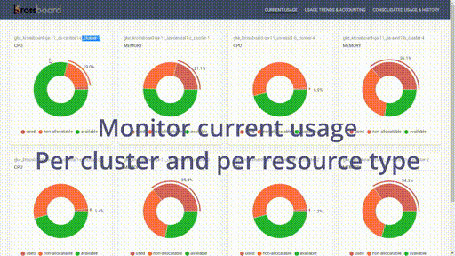

# 
> [Krossboard](https://krossboard.app/) provides a centralized resource usage analytics for multiple Kubernetes. Offerring cross-cloud and cross distribution analytics and dashboards across any number of Kubernetes instances, it's actively tested against Amazon EKS, Microsoft AKS, Google GKE Red Hat OpenShift, Rancher RKE, and various vanilla deployments.

## About this repository
This repository provides release packages, examples, as well as an open access to [scripts and built-in configuration files](tooling/setup) used to set up Krossboard. For example, you can review the actions performed by the [setup scripts](tooling/setup) during the setup of Krossboard against your managed Kubernetes on Amazon EKS, Google GKE, or Microsoft AKS.

The repository is also the place to submit issues and feature requests.

The Krossboard product team actively monitors the repo. We encourage feedback and always make our best to handle any issues as fast as possible.

## Useful Links
* [Open an issue or feature request](https://github.com/2-alchemists/krossboard/issues)
* [Documentation](https://krossboard.app/docs/)
* [Releases Information](https://krossboard.app/releases)
